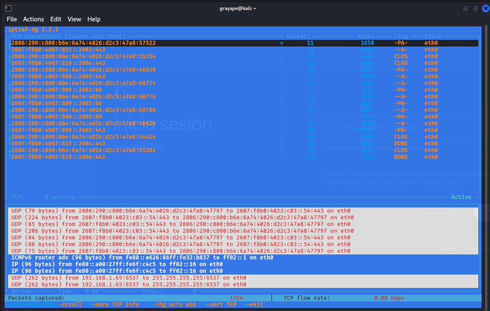
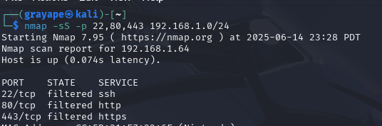

*Computer networks rely on many devices, protocols, services, standards, etc. that enable us to communicate with one another.*

## OSI MODEL
The Open Systems Interconnection (OSI) Model was created to standardize and streamline communication between networked devices.

### OSI Reference Model
- **Layer 7 Application**: Provides network services directly to user applications (HTTP, FTP, SMTP)
- **Layer 6 Presentation**: Handles data formatting, encryption/decryption (SSL, JPEG)
- **Layer 5 Session**: Manages communication sessions between devices (RPC, NetBIOS)
- **Layer 4 Transport**: Ensures reliable data transfer (TCP, UDP)
- **Layer 3 Network**: Handles logical addressing and routing (IP, ICMP)
- **Layer 2 Data Link**: Physical addressing and error detection (Ethernet, MAC)
- **Layer 1 Physical**: Transmits raw bit streams over physical media (Copper, Fiber)

Most devices operate on more than one layer, but to determine which layer a device is operating on, you must first identify the highest layer it is functioning on.

---

## Network Devices

### Layer 1 Devices:
- **Analog modem**: Developed to create connections between network segments via PSTN using POTS. Provides single connection (56Kbps max).
- **Hub**: Functions as a concentrator/repeater. Operates in half-duplex, creates single collision domain. Mostly obsolete.

### Layer 2 Devices:
- **Switch**: Uses ASIC chips to learn MAC addresses and forward frames intelligently. Creates separate collision domains per port.
- **Wireless Access Point (WAP)**: Bridges wireless and wired networks. Implements 802.11 standards (Wi-Fi 6, etc.).

### Layer 3 Devices:
- **Multilayer Switch (MLS)**: Combines Layer 2 switching with Layer 3 routing capabilities. High-performance but expensive.
- **Router**: Connects different networks using IP addressing. Maintains routing tables (static/dynamic routes).

## Security Devices

### Firewall
Operates at Layers 2-4 and 7 with two inspection methods:
- **Stateless**: Simple packet filtering (ACLs)
- **Stateful**: Tracks connection state (more secure)

### Intrusion Detection System (IDS)
- **Signature-Based**: Matches known attack patterns
- **Anomaly-Based**: Detects deviations from baseline
- **Policy-Based**: Enforces admin-defined rules

### Intrusion Prevention System (IPS)
Active system that can:
- Block malicious traffic
- Terminate connections
- Quarantine hosts
Best placed between firewall and internal network.

### VPN Concentrator
Specialized device for managing multiple VPN connections:
- Protocols: IPsec, SSL/TLS
- Functions: Authentication, encryption, access control
- Use cases: Remote access, site-to-site VPNs

## Optimization Devices
- **Load Balancer**: Distributes traffic across servers (Round Robin, Least Connections)
- **Proxy Server**: Intermediary for client requests (Forward/Reverse proxies)

---

## (PRACTICAL) Basic monitoring
- iftop 

  

- nethog

  

- iptraf-ng

  

---

## Network Access Applications
- **VPN**: Secure remote access (IPsec, SSL)
- **Remote Access**: RDP, SSH, Telnet
- **Web Services**: HTTP/HTTPS, REST APIs
- **Unified Voice**: VoIP, SIP trunking

## VPN Protocols
- **IPsec**: Secure encrypted tunnels (IKE, ESP)
- **GRE**: Generic Routing Encapsulation (no encryption)
- **PPTP**: Obsolete (MS-CHAP vulnerabilities)
- **TLS/SSL**: Common in web-based VPNs

## Network Access Services
- **NIC**: Network Interface Card (Physical/MAC address)
- **RADIUS**: Centralized authentication (UDP 1812)
- **TACACS+**: Cisco alternative (TCP 49, more secure)

---

## DHCP
Dynamic Host Configuration Protocol (DHCP) is a network management protocol used to automatically assign IP addresses and other network configuration parameters to client devices. It simplifies network management by reducing the need for manual IP configuration.

- **Static IP**: Manually configured IP address that does not change over time. Useful for servers, printers, and other critical devices.
- **Dynamic IP**: Automatically assigned by the DHCP server from a predefined pool. The address may change when the lease expires or the device reconnects.
- **DHCP Process (DORA)**:
  - **Discover**: Client sends broadcast request to locate a DHCP server.
  - **Offer**: Server responds with an available IP address and configuration options.
  - **Request**: Client requests the offered IP from one of the servers.
  - **Acknowledgment**: Server confirms the lease and completes the configuration.
- **Ports**: DHCP communication uses **UDP port 67** (server) and **UDP port 68** (client).
- **Leases**: IP addresses are assigned for a limited period (lease time). Clients must renew leases before expiration to keep their IPs.
- **Options**: Additional parameters provided by the DHCP server, such as default gateway, DNS servers, domain name, NTP servers, and more.
- **Preferred IP configuration**: Clients can request a specific IP address, and the server may honor the request if available.
- **DHCP Relay (IP Helper)**: Allows DHCP requests to be forwarded across subnets to a central DHCP server. Common in large networks to avoid deploying a DHCP server per subnet.

## DNS
The Domain Name System (DNS) translates domain names into IP addresses. It is a critical component of network communication and internet functionality.

- **Servers**: Include root, TLD, authoritative, and caching resolvers. Resolve queries from users to locate websites or services.
- **Records**:
  - **A/AAAA**: IPv4/IPv6 address records.
  - **CNAME**: Alias for another domain.
  - **MX**: Mail exchange server.
  - **NS**: Delegates a subdomain to a DNS server.
  - **PTR**: Reverse DNS mapping.
  - **TXT**: Text records (e.g., SPF, DKIM).
- **Dynamic DNS**: Automatically updates DNS records in real-time when devices join or leave the network, useful in environments with frequently changing IPs.

## NAT (Network Address Translation)
- **Static NAT**: 1:1 mapping (public:private)
- **Dynamic NAT**: Pool of public addresses
- **PAT (Port NAT)**: Many private to single public
- **Address Types**: Public/Private, RFC 1918

---

## (PRACTICAL) Service Enumeration
Tools used for querying, discovering, and enumerating information about services, particularly DNS and web services:

- **dig**: A powerful DNS lookup tool for querying specific DNS records and analyzing DNS responses.

  

- **dnsrecon**: Python-based tool for performing DNS enumeration, including brute force, zone transfers, and record collection.

  

- **curl**: Transfers data from or to a server using supported protocols (HTTP, FTP, etc.), ideal for testing endpoints.

  
  
- **wget**: Retrieves content from web servers, often used for downloading files or mirroring websites.

  

---

## WAN Technologies

### PSTN
- **Dial-up**: 56Kbps max (POTS)
- **ISDN**: Digital (128Kbps, BRI/PRI)
- **xDSL**: Digital Subscriber Line variants:
  - ADSL: Asymmetric (faster download)
  - VDSL: Very-high-bitrate (fiber hybrid)

### Broadband
- **DOCSIS**: Cable modem standard (3.1 = 10Gbps)
- **Fiber**:
  - FTTH: Fiber to Home
  - FTTC: Fiber to Curb
  - FTTN: Fiber to Node

### Wireless
- **Cellular**: 4G LTE, 5G (mmWave)
- **WiMAX**: IEEE 802.16 (alternative to DSL)
- **Satellite**: High latency (Geostationary/LEO)

### Enterprise WAN
- **Metro Ethernet**: Ethernet over MAN
- **Leased Lines**: T1 (1.544Mbps), E1 (2.048Mbps)
- **MPLS**: Label switching for QoS
- **Frame Relay**: Legacy packet-switched
- **ATM**: Fixed 53-byte cells (obsolete)

---

## Network Cabling

### Twisted Pair
- **UTP**: Unshielded (Cat5/6)
- **STP**: Shielded (industrial environments)
- **Plenum**: Fire-retardant jacket
- **Cable Types**:
  - **Straight-through**: Host to switch
  - **Crossover**: Like devices (e.g., switch to switch)
  - **Rollover**: Console access (used with serial connections)

#### Connectors
- **RJ11**: 6P2C, used for telephone connections
- **RJ45**: 8P8C, used for Ethernet networking
- **66/110 Block**: Punch-down blocks used in structured cabling
- **Serial (DB9/DB25)**: Legacy connectors for console and serial data

#### Categories
- **Cat5**: 100 MHz, up to 100 Mbps (obsolete)
- **Cat5e**: 100 MHz, up to 1 Gbps
- **Cat6**: 250 MHz, up to 10 Gbps (up to 55m)
- **Cat6a**: 500 MHz, up to 10 Gbps (up to 100m)

### Coaxial Cabling
- **Shielded Core**: Central copper conductor with insulating layer and metallic shield
- **Use Cases**: Cable TV, broadband internet, CCTV

#### Cable Types
- **RG-6**: Modern standard for TV/Internet; thicker, less signal loss
- **RG-59**: Older CCTV applications; thinner, more signal loss
- **RG-11**: Best for long-distance runs; thick and less flexible

#### Connectors
- **BNC**: Quick-connect used in CCTV and legacy Ethernet
- **F-type**: Screw-type connector for TV and modems
- **N-type**: Durable connector for outdoor and industrial RF use

### Fiber Optic Cabling
- **Glass or Plastic Core**: Transmits light signals instead of electricity
- **Use Cases**: High-speed LANs, WANs, backbone cabling

#### Cable Types
- **Single-mode (SMF)**: 9µm core, laser light, long-range (up to 100km)
- **Multi-mode (MMF)**: 50/62.5µm core, LED light, short-range (up to 2km)

#### Connectors
- **LC**: Compact connector, common in data centers
- **SC**: Push-pull connector, widely used in telecom
- **ST**: Twist-lock connector, used in legacy fiber systems
- **MTP/MPO**: Multi-fiber connectors for 40/100+ Gbps links

### Media Converters
Devices that allow different types of media to interconnect (e.g., copper to fiber). Useful in extending network distances or integrating older equipment.

- **Copper-to-Fiber**: Converts electrical signals to optical
- **Single-mode to Multi-mode**: Adapts fiber types
- **Bidirectional (BiDi)**: Uses a single fiber strand for TX/RX
- **Managed vs Unmanaged**: Managed converters offer SNMP/monitoring

## Cabling Tools
Essential tools for installing, testing, and maintaining network cables.

- **Crimpers**: Used to attach RJ45/RJ11 connectors to cable ends
- **Wire strippers**: Remove insulation from cables without damaging conductors
- **Punchdown tool**: Terminates wires into punchdown blocks (66/110)
- **Cable tester**: Verifies correct pinouts, continuity, and detects shorts
- **TDR (Time Domain Reflectometer)**: Tests copper cable length, detects breaks or shorts
- **OTDR (Optical Time Domain Reflectometer)**: Tests fiber length, loss, and faults

---

## Network Topologies
Describes how network devices are physically or logically arranged.

- **Peer-to-peer**: Devices communicate directly without central server
- **Client/server**: Centralized services with dedicated servers
- **Hybrid**: Mix of two or more topologies
- **Bus**: Single backbone with terminators at ends (legacy)
- **Ring**: Devices connected in circular fashion; one device failure can disrupt network
- **Star**: All devices connect to a central hub or switch
- **Mesh**: Devices interconnect with many redundant paths (full/partial)
- **Point-to-point**: Direct connection between two devices
- **Point-to-multipoint**: Central node communicates with multiple endpoints
- **MPLS**: Logical overlay that uses labels instead of IP routes for fast, efficient routing

## Network Infrastructure Implementations
Defines the scope and scale of network coverage.

- **PAN (Personal Area Network)**: Short-range (e.g., Bluetooth, USB tethering)
- **LAN (Local Area Network)**: Covers a single building or campus
- **MAN (Metropolitan Area Network)**: Spans a city or large campus
- **WAN (Wide Area Network)**: Covers large geographic areas (e.g., the Internet)
- **SCADA (Supervisory Control and Data Acquisition)**: Industrial control systems for monitoring and controlling infrastructure (e.g., power plants, water treatment)
- **Medianet**: Cisco term for networks optimized for media (e.g., video conferencing, streaming)

---

## IP Addressing

### IPv4 Properties
- IPv4 uses 32-bit addresses written in dotted decimal notation (e.g., 192.168.1.1).
- It supports around 4.3 billion unique addresses.
- Each address has a network and host portion.
- Paired with a subnet mask to define network boundaries.

### Classes of IPv4 Addresses
- Class A: 0.0.0.0 – 127.255.255.255
- Class B: 128.0.0.0 – 191.255.255.255
- Class C: 192.0.0.0 – 223.255.255.255
- Class D: 224.0.0.0 – 239.255.255.255 (Multicast)
- Class E: 240.0.0.0 – 255.255.255.255 (Experimental)

### Classless IPv4 Addresses
- CIDR (Classless Inter-Domain Routing) replaces class-based addressing.
- Allows flexible subnetting with prefix notation (e.g., /24).
- Enables efficient IP allocation and route aggregation.

### Subnetting IPv4 Addresses
- Divides networks into smaller subnetworks.
- Reduces broadcast domains, improves performance and security.
- Key concepts: subnet mask, network ID, broadcast address, host range.

### IPv6 Address Structure
- IPv6 uses 128-bit hexadecimal addresses (e.g., 2001:0db8::1).
- Written in eight 16-bit blocks, compressed with "::" where applicable.
- Vast address space to accommodate modern internet growth.

### IPv6 Network Transmissions
- IPv6 supports:
  - Unicast (one-to-one)
  - Multicast (one-to-many)
  - Anycast (one-to-nearest)
- IPv6 does **not** use broadcast.

---

## Special IP Networking Concepts

### The Media Access Control Address
- MAC address is a unique hardware address assigned to NICs.
- 48-bit address in hexadecimal (e.g., 00:1A:2B:3C:4D:5E).
- Operates at Layer 2 of the OSI model.

### Collision Domains vs. Broadcast Domains
- **Collision domain**: where data packets can collide (typically within hubs).
- **Broadcast domain**: where a broadcast packet is propagated (limited by routers).
- Switches separate collision domains; routers separate broadcast domains.

### Types of Network Transmissions
- **Unicast**: one sender to one receiver.
- **Broadcast**: one sender to all devices (IPv4 only).
- **Multicast**: one sender to specific group.
- **Anycast**: one sender to the closest receiver (IPv6).

---

## Routing

### Static Routing
- Routes are manually configured by an admin.
- Simple but not scalable; no automatic path updates.

### Dynamic Routing
- Routers learn routes from each other automatically.
- Uses protocols like OSPF, EIGRP, RIP, and BGP.

### Default Route
- A catch-all route when no specific match is found.
- Usually points to the internet gateway.
- Represented as `0.0.0.0/0` or `::/0`.

### Routing Table
- Stores all known routes to destination networks.
- Includes static, dynamic, and default routes.

### Loopback Interface
- A virtual interface used for diagnostics and stability.
- IPv4: 127.0.0.1, IPv6: ::1

### Routing Loop
- A situation where packets endlessly circulate due to misconfiguration.
- Prevented using TTL, split horizon, or route poisoning.

### Routing Metrics
- Values used to determine the best route.
- Includes hop count, bandwidth, delay, reliability, and cost.

### Routing Aggregation
- Combines multiple routes into one summary route.
- Reduces routing table size and simplifies configuration.

### High Availability
- Ensures continuous network operation through redundancy.
- Technologies: VRRP, HSRP, GLBP, failover routing, load balancing.

## Routing Protocols

### IGP (Interior Gateway Protocol)
- IGPs are used for routing **within a single autonomous system (AS)**.
- Designed for internal network communication and fast convergence.
- Common IGPs:
  - **RIP (Routing Information Protocol)** – Distance-vector, simple but limited.
  - **OSPF (Open Shortest Path First)** – Link-state, scalable, widely used.
  - **EIGRP (Enhanced Interior Gateway Routing Protocol)** – Cisco proprietary, advanced distance-vector.

### EGP (Exterior Gateway Protocol)
- EGPs are used for routing **between autonomous systems**, usually across the internet.
- The primary EGP is:
  - **BGP (Border Gateway Protocol)** – Path-vector protocol used by ISPs and enterprises to exchange routing information on the internet.
- EGPs focus on **policy-based routing** and scalability, rather than speed of convergence.

---

## (PRACTICAL) Network and connectivity analysis

### ping
Ping is used to test connectivity to another host on a network. It sends ICMP Echo Request messages and reports whether the host responds, along with the round-trip time. It helps detect basic network reachability issues.

### traceroute
Traceroute shows the path that packets take to reach a destination. It lists each router (hop) along the path and measures latency to each one. It is useful for diagnosing where delays or drops occur in the route.

### ip
The `ip` command is used to manage network interfaces, addresses, routing tables, and ARP entries. It replaces older tools like `ifconfig`, `route`, and `arp`, providing more functionality and flexibility.

### netcat
Netcat is a flexible tool used for network diagnostics and debugging. It can open TCP or UDP connections, listen on ports, transfer files, and test services. It is also used for banner grabbing and setting up reverse shells in security contexts.

## Unified communication

### Unified communication devices
Unified communication devices include hardware that enables integrated communications, such as IP phones, video conferencing systems, headsets, speakerphones, and collaboration hubs. These devices are optimized for services like VoIP, video calls, screen sharing, and real-time messaging.

Examples:
- IP desk phones with video support
- USB headsets with noise cancellation
- Smart conferencing cameras with tracking
- Interactive whiteboards

### Voice over IP
Voice over IP (VoIP) allows voice communication over the internet rather than traditional phone lines. It converts voice into digital packets and sends them over IP networks. VoIP reduces communication costs and enables integration with other services like video and chat.

Advantages:
- Lower cost than PSTN
- Integration with UC platforms
- Scalability and portability
- Advanced call features (voicemail-to-email, call routing, etc.)

Common VoIP Protocols:
- SIP (Session Initiation Protocol)
- RTP (Real-time Transport Protocol)
- H.323

## Virtualization

Virtualization is the process of creating a virtual version of physical hardware or resources, allowing multiple systems to run on a single physical machine. It improves hardware utilization, scalability, and flexibility in modern IT environments.

### Hypervisor
A hypervisor is software that creates and runs virtual machines (VMs). It abstracts physical hardware and enables multiple operating systems to run independently on the same physical host.

Types:
- **Type 1 (bare-metal)**: Runs directly on hardware (e.g., VMware ESXi, Microsoft Hyper-V, Xen).
- **Type 2 (hosted)**: Runs on top of a host OS (e.g., VirtualBox, VMware Workstation).

### Virtual machine manager
A virtual machine manager (VMM) is the component that manages the execution of virtual machines. It allocates resources, handles VM states (start, pause, snapshot), and interfaces with the hypervisor.

### Components of virtualization
- **Hypervisor**: Creates and manages virtual machines.
- **Guest OS**: Operating system installed inside the VM.
- **Virtual hardware**: Emulated components (CPU, RAM, NIC).
- **Management tools**: Interfaces for creating, monitoring, and configuring VMs.

### Software defined networking
Software-Defined Networking (SDN) decouples the control plane from the data plane in network devices. Instead of configuring hardware individually, SDN enables centralized management via software controllers.

Benefits:
- Centralized control
- Programmability
- Faster automation
- Improved scalability

---

## Storage area networks

Storage Area Networks (SANs) are high-speed networks that provide access to consolidated storage resources. SANs are commonly used in enterprise environments for block-level storage, enabling efficient data transfer between servers and storage devices.

Technologies:
- **Fibre Channel (FC)**
- **iSCSI**
- **FCoE (Fibre Channel over Ethernet)**

Advantages:
- High performance
- Centralized storage
- Better backup and disaster recovery options

---

## Cloud computing

Cloud computing delivers computing services (e.g., servers, storage, databases, networking) over the internet (“the cloud”). It allows for on-demand resources, flexible scaling, and reduced infrastructure costs.

### Classification of cloud computing
- **Deployment Models**:
  - **Public Cloud**: Shared infrastructure (e.g., AWS, Azure).
  - **Private Cloud**: Dedicated resources for one organization.
  - **Hybrid Cloud**: Combination of public and private environments.
- **Service Models**:
  - **IaaS (Infrastructure as a Service)**: Virtual machines, networks (e.g., AWS EC2).
  - **PaaS (Platform as a Service)**: Runtime environments for development (e.g., Heroku).
  - **SaaS (Software as a Service)**: End-user applications (e.g., Google Workspace, Office 365).

---

## Network monitoring

Network monitoring involves observing network activity to detect performance issues, downtime, unauthorized access, or security incidents. Tools and logs play a critical role in maintaining operational integrity.

### Tools to monitor the network
Common tools include:
- **iftop**: Real-time bandwidth monitoring by host.
- **nethogs**: Per-process bandwidth usage.
- **iptraf-ng**: Traffic monitoring and statistics.
- **Wireshark**: Deep packet inspection.
- **tcpdump**: Command-line packet capture.
- **Nagios/Zabbix**: Monitoring servers and network devices for availability and performance.

### Log files
Logs provide historical records of events that occur within a system or network. They are critical for troubleshooting, auditing, and forensic investigations.

Key network-related logs:
- **Firewall logs**: Blocked/allowed traffic.
- **DHCP logs**: IP lease history.
- **DNS logs**: Query/resolution attempts.
- **Router/Switch logs**: Port activity, uptime, errors.
- **Authentication logs**: Login attempts, SSH access.

Log analysis can reveal:
- Intrusion attempts
- Misconfigurations
- Performance bottlenecks
- System failures

### Port scanners

#### nmap
Nmap is a powerful network scanner used to discover hosts, open ports, and services running on a network. It is widely used in security auditing and penetration testing for network reconnaissance and vulnerability detection.

### Interface monitoring/packet flow monitoring

#### tcpdump
Tcpdump is a command-line packet analyzer that captures network traffic in real time. It allows users to filter, inspect, and save packets for further analysis. It's lightweight and widely used for diagnostics, scripting, and remote network troubleshooting.

#### wireshark
Wireshark is a graphical network protocol analyzer used to capture and interactively examine packets. It supports deep inspection of hundreds of protocols and is ideal for debugging, protocol development, and learning how networks operate.

## Configuration management

Configuration management is the process of systematically handling changes to maintain the integrity and performance of IT systems and networks. It ensures that hardware, software, firmware, and documentation are consistent and traceable.

Key tools:
- **Ansible**: Agentless configuration automation tool using YAML playbooks.
- **Puppet**: Declarative configuration management for infrastructure as code.
- **Chef**: Uses Ruby for defining infrastructure policies.
- **SaltStack**: Scalable configuration management and remote execution.

Benefits:
- Reduced configuration errors
- Faster deployments
- Easier rollback and version control
- Improved compliance

---

## Documentation

Network documentation refers to detailed records of the architecture, configuration, and policies governing a network. It's essential for troubleshooting, audits, onboarding, and maintaining consistency.

Types of documentation:
- **Network topology diagrams**: Visual representation of physical/logical layout.
- **IP address allocation**: Subnets, reservations, DHCP scopes.
- **Device inventory**: Switches, routers, firewalls, and their configurations.
- **Change logs**: History of updates and modifications.
- **Access control**: Who has access to what and why.

Well-maintained documentation saves time and reduces risk during outages or staff transitions.

---

## Backups

Backups are copies of data or configurations stored separately to restore systems in case of failure, corruption, or disaster.

Backup types:
- **Full**: Complete copy of all selected data.
- **Incremental**: Only data changed since the last backup.
- **Differential**: Data changed since the last full backup.

What to back up:
- Router and switch configs
- Server data and databases
- Virtual machines
- Firewall rules and ACLs

Storage options:
- On-site (external drives, NAS)
- Off-site (remote data center)
- Cloud-based (AWS S3, Google Cloud Storage)

Regular testing of backups is critical for disaster recovery readiness.

---

## Bring your own device policy

A BYOD (Bring Your Own Device) policy governs how employees can use their personal devices (phones, laptops, tablets) to access corporate networks and data.

Security considerations:
- Enforce strong authentication (e.g., MFA)
- Require device encryption
- Use mobile device management (MDM)
- Restrict access based on role or location
- Monitor for malicious or non-compliant behavior

Benefits:
- Increased flexibility and user satisfaction
- Reduced hardware costs

Risks:
- Data leakage
- Malware introduction
- Non-compliant endpoints

---

## Network segmentation

Network segmentation is the practice of dividing a network into smaller subnetworks (segments) to improve performance and security.

Types:
- **Physical segmentation**: Using separate hardware (e.g., VLANs across switches).
- **Logical segmentation**: Using VLANs, ACLs, firewalls to control traffic.

Benefits:
- Limits lateral movement of attackers
- Improves network performance
- Enables role-based access control
- Helps contain malware or breaches to isolated segments

Common segments:
- User LAN
- Server VLAN
- Management network
- Guest Wi-Fi
- IoT/OT devices

Segmentation is a fundamental part of zero-trust architectures and defense-in-depth strategies.
## Switches

Switches are Layer 2 (and sometimes Layer 3) devices that forward Ethernet frames based on MAC addresses. They are essential for connecting devices within a local area network (LAN) and creating efficient, collision-free communication paths.

### Unmanaged vs. managed switches

Unmanaged switches are plug-and-play and offer no configuration capabilities. They are typically used in small networks or home environments.

Managed switches provide features such as VLAN support, port mirroring, STP configuration, traffic monitoring, and SNMP integration. They are used in enterprise or complex networks where control and visibility are needed.

### Spanning tree protocol

Spanning Tree Protocol (STP) prevents loops in Layer 2 networks by detecting redundant paths and selectively blocking ports to maintain a loop-free topology. Enhanced versions like RSTP and MSTP provide faster convergence and multiple tree support.

### Switch port

A switch port is a physical interface that connects a device to the switch. Ports can be configured to behave differently:
- Access ports carry traffic for a single VLAN.
- Trunk ports carry traffic for multiple VLANs using tagging.
- Mirrored ports replicate traffic for monitoring or analysis.

### VLAN

A Virtual LAN (VLAN) logically segments a network into isolated domains, even if they share the same physical infrastructure. VLANs help improve security, manageability, and traffic isolation.

### Trunking

Trunking allows multiple VLANs to be transmitted over a single physical link between switches or between a switch and router. The IEEE 802.1Q standard is commonly used for tagging VLAN information in Ethernet frames.

### Port bonding

Port bonding, also known as link aggregation or EtherChannel, combines multiple physical interfaces into one logical link. This provides increased bandwidth and redundancy between devices.

### Power over Ethernet

Power over Ethernet (PoE) delivers both electrical power and data over a single Ethernet cable. It is commonly used for powering access points, IP phones, and surveillance cameras without needing separate power sources.

### Port mirroring

Port mirroring is used to duplicate the traffic from one or more switch ports to another port for monitoring or analysis. It is commonly used with intrusion detection systems or packet capture tools.

---

## WLAN infrastructure

Wireless LAN infrastructure enables network access using radio waves instead of physical cabling. It includes access points, wireless controllers, and antennas to provide reliable wireless coverage and performance.

### Wireless Access Standards

Wi-Fi standards define capabilities like frequency, speed, and channel width:
- 802.11a: 5 GHz, up to 54 Mbps
- 802.11b/g: 2.4 GHz, up to 11/54 Mbps
- 802.11n: 2.4/5 GHz, up to 600 Mbps with MIMO
- 802.11ac: 5 GHz, up to 1 Gbps with MU-MIMO
- 802.11ax (Wi-Fi 6): High efficiency, works on both 2.4 and 5 GHz

### Antenna technology

Antenna types influence coverage and direction:
- Omnidirectional antennas radiate in all directions, ideal for general coverage.
- Directional antennas focus the signal in a specific direction, useful for point-to-point links.
- MIMO (Multiple Input, Multiple Output) improves speed and reliability using multiple antennas.

### Wireless Access Points

Access points (APs) bridge wireless clients to the wired LAN. They support multiple SSIDs, VLAN tagging, and security features like WPA3. Enterprise APs can be managed individually or via a central controller or cloud platform.

---

## WLAN topologies

### Ad hoc topology

In an ad hoc topology, devices communicate directly with one another without an access point. This setup is temporary and lacks central control or scalability.

### Infrastructure topology

The most common WLAN topology. Devices connect to the network through a central access point, which manages traffic and connects to the wired LAN.

### Mesh topology

In mesh networks, multiple APs connect to each other wirelessly, forming a resilient and self-healing network. If one node fails, traffic reroutes through others. Common in large areas or outdoor deployments.

### SSID

The Service Set Identifier (SSID) is the name of the wireless network broadcasted by an access point. Clients use the SSID to identify and join the correct network. A single AP can broadcast multiple SSIDs, each mapped to a different VLAN or policy group.

### BSSID

The Basic Service Set Identifier (BSSID) is the MAC address of the radio interface on the access point. While the SSID is the network name seen by users, the BSSID uniquely identifies each AP or radio. This helps differentiate between access points broadcasting the same SSID.

## Security Concepts

### Disaster Recovery Plan
A documented and structured approach that describes how an organization can quickly resume work after an unplanned incident. It focuses on restoring IT systems, applications, and data to ensure minimal downtime. It includes backup solutions, disaster recovery sites, regular testing, and emergency roles and responsibilities.

### Business Continuity Plan
A proactive plan to ensure that critical business operations can continue during and after a disaster. It includes risk assessments, continuity strategies, personnel roles, alternate communication methods, and physical/IT infrastructure requirements.

### Single Point of Failure (SPOF)
A component in a system that, if it fails, will stop the entire system from working. Examples include a single server in a critical workflow or one network switch connecting all departments. Eliminated through redundancy, clustering, and high availability designs.

### Uninterruptable Power Supply (UPS)
A device that provides emergency power when the main power source fails. It protects hardware like servers and networking equipment from sudden power loss, allowing systems to safely shut down or switch to generators.

### First Responders
Individuals trained to react immediately to IT incidents such as cyberattacks or physical security breaches. They perform tasks such as evidence preservation, initiating containment procedures, and notifying relevant authorities or response teams.

### Data Breach
An incident where sensitive, protected, or confidential data is accessed, disclosed, or stolen by unauthorized individuals. Can occur due to poor security configurations, insider threats, or external attackers.

---

## Common Network Vulnerabilities

### Telnet
A protocol used for remote login to devices, but it sends data in plaintext. Vulnerable to sniffing and man-in-the-middle attacks. It is largely replaced by SSH.

### SNMPv1 and SNMPv2
Older versions of the Simple Network Management Protocol that do not offer encryption. SNMPv3 includes secure authentication and encryption features.

### FTP (File Transfer Protocol)
Used for transferring files between systems but lacks encryption, making it vulnerable to interception of credentials and data.

### TFTP (Trivial File Transfer Protocol)
A simple, unauthenticated version of FTP used mainly in LANs. Frequently exploited due to its lack of security features.

### HTTP
Used to deliver web pages, but it transmits data in plaintext. Susceptible to interception. HTTPS should be used instead to ensure encryption.

### SLIP (Serial Line Internet Protocol)
An outdated protocol used to encapsulate IP packets over serial lines. It lacks error correction, encryption, and is no longer in use in modern systems.

---

## Vulnerable Network Practices

### Unpatched or Legacy Systems
Older systems or those missing security updates are prone to exploitation through known vulnerabilities. Maintaining patch management policies is critical.

### Open Ports
Ports that are open unnecessarily can serve as entry points for attackers. Regular port scanning and firewall policies are used to limit exposure.

### Unnecessary Running Services
Services running on systems that are not needed can increase the attack surface. These should be disabled or removed.

### Clear Text Credentials
Credentials transmitted without encryption can be intercepted using sniffing tools. Use of encryption protocols (e.g., SSH, TLS) is mandatory.

### Unencrypted Channels
Communication channels (e.g., HTTP, Telnet) without encryption allow attackers to view and manipulate data in transit.

### RF Emanation
Radio Frequency signals emitted by devices can be intercepted to extract sensitive information (e.g., keyboard input or screen data). Shielding and secured zones can mitigate this.

---

## Common Network Threats

### Inside Threats

#### Malicious Employee
A trusted insider with malicious intent, often exploiting their access to steal data, sabotage systems, or exfiltrate information.

#### Compromised System
A system that has been taken over by malware or remote attackers, potentially being used for launching attacks within the network.

#### Social Engineering
Psychological manipulation that tricks users into giving up confidential information or performing unsafe actions. Common forms include phishing, vishing, and baiting.

#### ARP Cache Poisoning
An attacker sends forged ARP responses to associate their MAC address with another host’s IP, enabling them to intercept, modify, or stop data intended for that host.

#### Protocol or Packet Abuse
Malicious use of networking protocols to manipulate or overload devices, such as crafting malformed packets to bypass firewalls or crash systems.

#### Man-in-the-Middle Attack
The attacker secretly intercepts and possibly alters communication between two parties who believe they are directly communicating with each other.

#### VLAN Hopping
Exploiting network switch configurations to gain access to traffic on other VLANs, which are intended to be isolated from each other.

### Outside Threats

#### Zero-Day Attacks
Attacks that exploit previously unknown vulnerabilities for which no patch exists. Extremely dangerous and hard to defend against.

#### Brute Force Attacks
Systematic attempts to guess passwords or cryptographic keys by trying every possible combination.

#### Spoofing
Impersonating another device or user on a network, such as IP spoofing or email spoofing, to bypass access controls or spread malware.

#### Session Hijacking
Taking control of a user's active session by stealing or predicting session tokens, allowing attackers to impersonate them.

#### Denial of Service (DoS)

- **Traditional DoS:** Floods a target system with traffic, making it unavailable to legitimate users.
- **Permanent DoS (PDoS):** Destroys or corrupts hardware or firmware, requiring replacement.
- **Unintentional DoS:** Caused by configuration errors or legitimate use spikes.
- **Distributed DoS (DDoS):** Coordinated attacks from multiple sources (botnets).
- **Reflective DoS:** Exploits third-party servers to reflect and amplify traffic to the victim.
  - Reflective DNS
  - Reflective NTP
- **Smurf Attacks:** Exploits ICMP and broadcast addresses to amplify attacks using spoofed source IPs.

---

## Wireless Network Threats

### WPS (Wi-Fi Protected Setup)
A simplified wireless connection method that is vulnerable to brute-force attacks due to predictable PINs.

### War Driving / War Chalking
Scanning for unsecured wireless networks while driving. War chalking refers to marking these networks physically or digitally.

### WEP / WPA Cracking
Breaking weak encryption in outdated Wi-Fi protocols. WEP is especially vulnerable; WPA2 and WPA3 are preferred.

### Rogue Access Point
Unauthorized wireless access point set up to intercept traffic or lure users into connecting.

### Evil Twin Attack
A fake wireless AP mimicking a legitimate one to perform man-in-the-middle attacks on connected users.

### Bluejacking
Sending unsolicited messages to nearby Bluetooth devices. Not highly dangerous but often used to annoy or trick users.

### Bluesnarfing
Unauthorized access to data on a Bluetooth-enabled device. Can expose contacts, emails, files, etc.

---

## Practical Tools

### Bettercap
A powerful, modular network attack and monitoring tool capable of conducting MITM attacks, sniffing traffic, manipulating packets, DNS spoofing, and injecting code in real time. Supports plugins and scripting.

### hping3
A network scanning and packet crafting tool used to generate custom TCP/IP packets. Commonly used for firewall testing, spoofing, and DoS simulations. Also useful in OS fingerprinting.

### Scapy (Python Library)
A powerful Python-based packet manipulation tool used for crafting, sending, sniffing, and analyzing network traffic. Supports multiple protocols and allows the creation of custom packet flows and fuzzing.

---

## Network Hardening Techniques

Network hardening involves reducing vulnerabilities in your network infrastructure to protect against attacks and unauthorized access.

### Secure Protocols

Use **secure alternatives** to insecure network protocols:

| Insecure Protocol | Secure Alternative | Description                            |
|-------------------|--------------------|----------------------------------------|
| FTP               | SFTP / FTPS        | Secures file transfer with SSH or SSL  |
| Telnet            | SSH                | Encrypts remote terminal communication |
| HTTP              | HTTPS              | Encrypts web traffic using TLS         |
| SNMPv1/v2         | SNMPv3             | Adds authentication and encryption     |
| POP3 / IMAP       | POP3S / IMAPS      | Email protocols over SSL/TLS           |

### Anti-Malware Software

Protect endpoints and servers with:

- **Signature-based detection** (detects known threats)
- **Heuristic/Behavioral analysis** (detects unknown threats)
- **Real-time protection** (active scanning of file activity)
- **Automated updates** for malware definitions
- **Centralized management** for enterprise deployments

**Examples**: Windows Defender, ESET, Malwarebytes, CrowdStrike

### Switch and Router Security Measures

- Disable unused ports and interfaces
- Use MAC address filtering
- Enable port security (limit number of MACs per port)
- Allow SSH access only (disable Telnet)
- Change all default usernames and passwords
- Use VLANs for network segmentation
- Enable logging and use SNMPv3 for secure monitoring

### Encryption Basics

- **Symmetric encryption**: One shared key (e.g., AES, DES)
- **Asymmetric encryption**: Public/private key pair (e.g., RSA, ECC)
- **TLS/SSL**: Encrypts traffic for secure communications
- **IPsec**: Encrypts network traffic (used in VPNs)
- **Hashing**: Ensures data integrity (SHA-256, SHA-3)

### Wireless Network Hardening

- Use **WPA3** (or at least WPA2 with AES)
- Disable **WPS** to prevent brute-force attacks
- Change default **SSID** and admin credentials
- Enable **MAC filtering**
- Use **client isolation** on guest/public networks
- Apply **firmware updates** regularly
- Limit **signal range** to control exposure

### User Authentication

- Enforce strong password policies
- Implement multi-factor authentication (MFA)
- Apply account lockout after multiple failures
- Audit and disable unused accounts regularly
- Use session timeouts and re-authentication

### Authentication and Authorization Methods

- **PAP (Password Authentication Protocol)**  
  Sends credentials in plaintext. Insecure and outdated.

- **CHAP (Challenge Handshake Authentication Protocol)**  
  Uses challenge-response and hashing. More secure than PAP.

- **EAP (Extensible Authentication Protocol)**  
  Framework for multiple authentication types (e.g., EAP-TLS, EAP-TTLS, PEAP). Common in WPA2/WPA3 Enterprise and 802.1X.

- **Kerberos**  
  Ticket-based mutual authentication using a **Key Distribution Center (KDC)**. Common in Active Directory environments.

---

## Physical Network Security

Secure the physical infrastructure against unauthorized access, damage, or theft.

### Credential Workaround

- Set BIOS/UEFI passwords
- Disable booting from USB or CD devices
- Encrypt drives (e.g., BitLocker, LUKS)
- Monitor and log access to devices and consoles

### Basic Physical Security

- Locked doors to server/network rooms
- Surveillance cameras
- Alarm systems
- Cable management to prevent tampering

### Intermediate Physical Security

- Security guards and access controls
- Access cards and RFID key fobs
- Mantraps (double door entry)
- Motion detectors
- EMI/RFI shielding for cables

### Advanced Physical Security

- Biometric access (fingerprint, iris)
- Faraday cages for sensitive hardware
- Hardened server racks/cabinets
- Fire suppression and climate control systems
- Backup power (UPS/generators)

### Methods of Physical Security

- **Deterrence**: Cameras, lighting
- **Detection**: Sensors, surveillance
- **Delay**: Locks, reinforced doors
- **Response**: Security staff, alarm systems

---

## Firewall Basics

Firewalls monitor and control incoming and outgoing traffic based on defined security rules.

### Types of Firewalls

| Type                | Description                                      |
|---------------------|--------------------------------------------------|
| Packet Filtering    | Filters traffic by IP, port, protocol            |
| Stateful Inspection | Tracks connections and ensures stateful traffic |
| Application Layer   | Filters traffic for specific applications        |
| Next-Gen Firewall   | Includes DPI, IDS/IPS, app awareness             |
| Host-based Firewall | Installed on devices (e.g., Windows Firewall)    |
| Network Firewall    | Protects entire segments (e.g., pfSense, Cisco)  |

### Firewall Settings and Techniques

- Use a **default deny** policy (block all, allow explicitly)
- Only allow necessary ports and IP ranges
- Enable **NAT** to hide internal network
- Configure **intrusion detection/prevention (IDS/IPS)**
- Enable **logging and monitoring**
- Update firmware and apply patches regularly

---

## Network Access Control (NAC)

- Restricts network access based on policies and device health
- Integrates with **802.1X** and **RADIUS servers**
- Enforces patch levels, antivirus status, device type
- Helps detect and block **rogue devices**
- Supports **guest network segmentation**

---

## Basic Forensic Concepts

- **Chain of custody**: Document all evidence handling
- **Disk imaging**: Bit-for-bit copy of storage for investigation
- **Volatile vs non-volatile data**: RAM vs storage
- **Hashing evidence**: Verifies integrity (SHA-256)
- **Timeline analysis**: Order of attack events
- **Live forensics**: Performed while system is running
- **Anti-forensics**: Tools/methods to hide traces or mislead investigators
