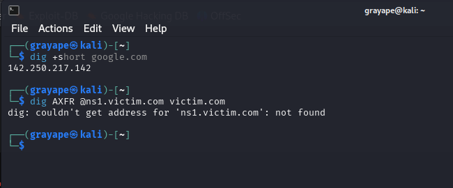
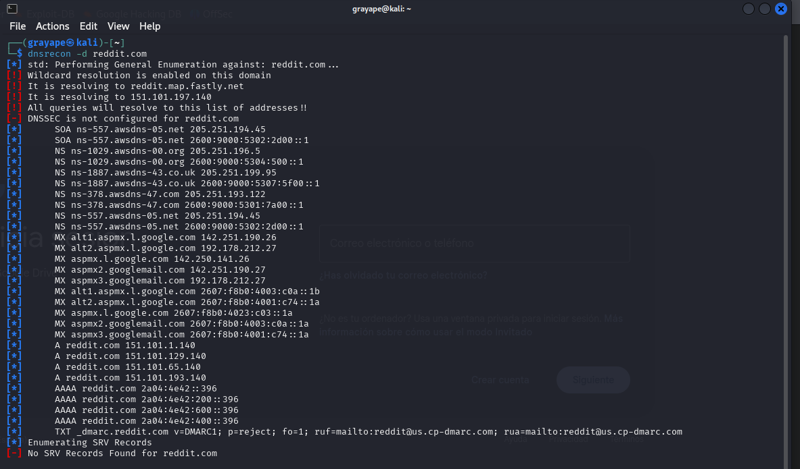

# 1  Addressing & Name Services

## 1.1  DHCP – Dynamic Host Configuration Protocol
Dynamic Host Configuration Protocol (DHCP) is a network management protocol used to automatically assign IP addresses and other network configuration parameters to client devices. It simplifies network management by reducing the need for manual IP configuration.

- **Static IP**: Manually configured IP address that does not change over time. Useful for servers, printers, and other critical devices.  
- **Dynamic IP**: Automatically assigned by the DHCP server from a predefined pool. The address may change when the lease expires or the device reconnects.  
- **DHCP Process (DORA)**:  
  - **Discover** – Client broadcasts to locate a DHCP server  
  - **Offer** – Server responds with an available IP and options  
  - **Request** – Client requests the offered IP  
  - **Acknowledgment** – Server confirms the lease  
- **Ports** – UDP 67 (server) / UDP 68 (client)  
- **Leases** – IPs are time-limited; clients renew before expiration.  
- **Options** – Extra parameters (gateway, DNS, domain, NTP, etc.).  
- **Preferred IP configuration** – Client can request a specific IP.  
- **DHCP Relay (IP Helper)** – Forwards DHCP across subnets to a central server.

---

## 1.2  DNS – Domain Name System
The Domain Name System (DNS) translates domain names into IP addresses. It is critical to network communication and Internet functionality.

- **Servers**: Root, TLD, authoritative, caching resolvers.  
- **Records**:  
  - **A / AAAA** – IPv4 / IPv6 address  
  - **CNAME** – Canonical name (alias)  
  - **MX** – Mail-exchange host  
  - **NS** – Delegates zone to another DNS server  
  - **PTR** – Reverse DNS  
  - **TXT** – Arbitrary text (SPF, DKIM, etc.)  
- **Dynamic DNS** – Real-time record updates for changing hosts.

---

## 1.3  NAT – Network Address Translation
- **Static NAT** – 1:1 public ↔ private mapping  
- **Dynamic NAT** – Uses a pool of public IPs  
- **PAT (Port Address Translation)** – Many private hosts share one public IP  
- **Address Types** – Public / Private (RFC 1918)

---

# 2  Practical Service Enumeration

Tools for discovering or interrogating network services (especially DNS/Web):

| Tool | Purpose |
|------|---------|
| **dig** | Query specific DNS records, analyze responses  |
| **dnsrecon** | Enumerate DNS (brute force, zone XFR)  |
| **curl** | Transfer data via HTTP, FTP, etc.  |
| **wget** | Download / mirror web content  |

---

# 3  Network Access & Remote Services

## 3.1  Access Applications
- **VPN** – Secure remote access (IPsec, SSL)  
- **Remote Access** – RDP, SSH, Telnet  
- **Web Services** – HTTP/HTTPS, REST APIs  
- **Unified Voice** – VoIP, SIP trunking

## 3.2  VPN Protocols
- **IPsec** – Encrypted tunnels (IKE, ESP)  
- **GRE** – Generic Routing Encapsulation (no encryption)  
- **PPTP** – Obsolete (MS-CHAP vulnerabilities)  
- **TLS/SSL** – Common in browser-based VPNs

## 3.3  Network Access Services
- **NIC** – Network Interface Card (MAC address)  
- **RADIUS** – Centralized authentication (UDP 1812)  
- **TACACS+** – Cisco alternative (TCP 49, encrypted)

---

# 4  Routing Fundamentals

## 4.1  Routing Concepts
### Static Routing
- Admin-configured; simple, not scalable.

### Dynamic Routing
- Routers share routes automatically (OSPF, EIGRP, RIP, BGP).

### Default Route
- Catch-all `0.0.0.0/0` or `::/0` pointing to the Internet gateway.

### Routing Table
- Contains static, dynamic, and default routes.

### Loopback Interface
- Virtual interface for diagnostics (IPv4 127.0.0.1 / IPv6 ::1).

### Routing Loop
- Packets circulate endlessly; mitigated by TTL, split-horizon, poisoning.

### Routing Metrics
- Hop count, bandwidth, delay, reliability, cost.

### Routing Aggregation
- Summarizes multiple routes to reduce table size.

### High Availability
- VRRP, HSRP, GLBP, failover routing, load balancing.

---

## 4.2  Routing Protocol Families

### Interior Gateway Protocols (IGP)
- **RIP** – Distance-vector  
- **OSPF** – Link-state  
- **EIGRP** – Advanced distance-vector (Cisco)

### Exterior Gateway Protocols (EGP)
- **BGP** – Path-vector for inter-AS routing; policy-driven, highly scalable.

---

# 5  Unified Communication

## 5.1  UC Devices
Hardware enabling integrated comms (voice, video, chat):

- IP desk phones with video  
- USB noise-canceling headsets  
- Smart conferencing cameras  
- Interactive whiteboards

## 5.2  Voice over IP (VoIP)
Voice travels as IP packets; integrates with other UC services.

**Advantages**: lower cost, scalable, portable, rich features (voicemail-to-email, call routing).

**Common Protocols**:  
- **SIP** – Session initiation  
- **RTP** – Real-time media transport  
- **H.323** – Legacy signaling

---

# 6  Protocol Landscape Cheat-Sheet
*Quick reference to where the above protocols live or what they solve.*

- **Routing** – RIP, OSPF, EIGRP, BGP  
- **Secure remote access** – SSH, TLS, IPsec  
- **Management & monitoring** – SNMP, NetFlow, Syslog, NTP  
- **Name resolution** – DNS, mDNS  
- **Addressing / assignment** – DHCP, SLAAC  
- **Email** – SMTP, IMAP, POP3  
- **File transfer & sharing** – FTP, SFTP, SMB, NFS  
- **Web** – HTTP/HTTPS, QUIC  
- **Messaging / IoT** – MQTT, AMQP
