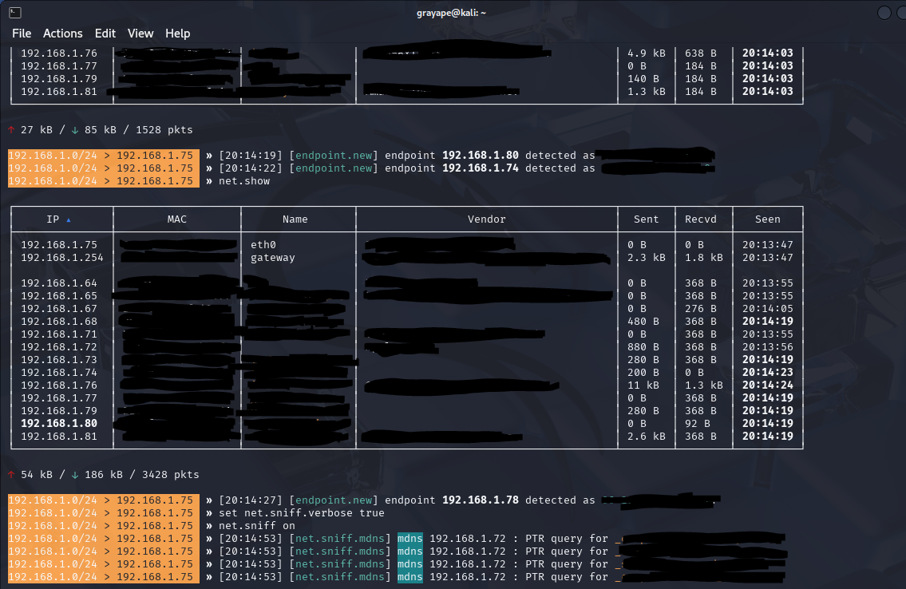
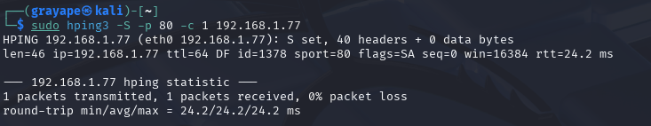
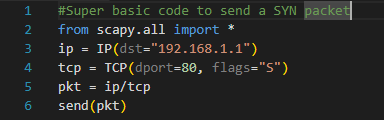

---

title: "1.4_network_security.net"
date: 2025-06-21T09:22:10-07:00
draft: false
toc: false
images:
tags:
  - Computer Networks
---

*Cryptographic walls, layered defenses, and relentless monitoring transform fragile links into fortress-grade networks.*

---
# 1  Defensive Infrastructure

## 1.1  Security Devices

### Firewall

Operates at Layers 2–4 and (in next‑gen models) Layer 7. It enforces policy at the edge or host level.

| Mode                    | How it works                                                                                         | Typical use cases                                         |
| ----------------------- | ---------------------------------------------------------------------------------------------------- | --------------------------------------------------------- |
| **Stateless filtering** | Simple ACL checks on source/destination IP, port, and protocol.                                      | High‑speed backbone filtering, low‑resource IoT gateways. |
| **Stateful inspection** | Maintains a connection table (five‑tuple) and allows only packets that match an established session. | Enterprise perimeter firewalls, data‑center cores.        |

> **Tip:** Combine stateless “trash filters” (bogons, multicast, Martians) with stateful rules for legitimate flows.

### Intrusion Detection / Prevention Systems

*IDS* monitors; *IPS* monitors **and** blocks.

| Engine              | Strengths                      | Weaknesses                                |
| ------------------- | ------------------------------ | ----------------------------------------- |
| **Signature‑based** | Low false‑positive rate, fast. | Misses zero‑day / obfuscated payloads.    |
| **Anomaly‑based**   | Detects novel attacks.         | Requires clean baselines; prone to noise. |
| **Policy‑based**    | Human‑readable, easy audits.   | Policy drift creates blind spots.         |

**Placement:** Behind the edge firewall (clean traffic) and before critical VLANs (early threat break).

### VPN Concentrator

Aggregates hundreds of tunnels, handling:

* **Authentication** – X.509, LDAP, RADIUS, MFA
* **Negotiation** – IKEv2 (IPsec) or TLS handshake (SSL‑VPN)
* **Traffic segregation** – Split‑tunnel vs. full‑tunnel, per‑group ACLs

A dedicated concentrator offloads crypto from border firewalls.

---

## 1.2  Firewall Administration Essentials

* Start with a **default‑deny** egress **and** ingress stance.
* Review rule sets at least **quarterly**; \~30 % of stale rules are common in mature networks.
* Enable **NAT/PAT** to obscure internal addressing and to limit inbound paths.
* Log to a **remote, tamper‑proof server**; rotate & compress daily.
* Subscribe to vendor advisories; patch **critical** vulns within **72 h**.

---

## 1.3  Network Access Control (NAC)

| Component                     | Role                                                                     |
| ----------------------------- | ------------------------------------------------------------------------ |
| **802.1X supplicant**         | Sends credentials (EAPOL) to switch/AP.                                  |
| **Authenticator (switch/AP)** | L2 middle‑point that relays to RADIUS.                                   |
| **RADIUS server**             | Verifies identity, checks posture (AV, patch level), returns VLAN / ACL. |

If posture fails, clients land in a **quarantine VLAN** with patch servers only.

---

# 2  Vulnerabilities & Weak Practices

## 2.1  Classic Protocol Weaknesses

| Protocol        | Why it is weak                                       | Modern fix                  |
| --------------- | ---------------------------------------------------- | --------------------------- |
| **Telnet**      | Plain‑text auth; no integrity.                       | SSH‑2 with key‑based auth.  |
| **SNMP v1/v2c** | Community strings in clear text.                     | SNMP v3 with AES + HMAC.    |
| **FTP**         | User/pass visible; passive mode firewall‑unfriendly. | SFTP or HTTPS object store. |
| **TFTP**        | No auth at all; UDP susceptible to spoofing.         | Secure boot/PXE with IPsec. |
| **HTTP**        | No encryption; MITM & cookie hijack.                 | Enforce HSTS + TLS 1.3.     |

## 2.2  Weak Operational Practices

* **Patch latency** – 30‑day delay exposes known CVEs (\~60 % of breaches).
* **Service sprawl** – Legacy RPC, NetBIOS, multicast left running.
* **Flat networks** – No segmentation → lateral movement is trivial.
* **Hard‑coded creds** in scripts & IoT.
* **Electromagnetic leakage** – Unshielded racks leak keystrokes (TEMPEST).

---

# 3  Threat Landscape

## 3.1  Insider Threats

* Disgruntled staff wiping backups or exfiltrating IP over covert DNS.
* Phished accounts → pass‑the‑hash pivot.
* \$10 Raspberry Pi bridging secure & guest VLANs.

> **Mitigation:** Mandatory vacations, least‑privilege RBAC, UEBA, strict USB controls.

## 3.2  External Attacks

* **Zero‑day exploits** – Micro‑segmentation limits blast radius.
* **Brute‑force / credential stuffing** – Rate‑limit logins; MFA.
* **BGP hijacking** – Adopt RPKI; monitor route origin validation.
* **DNS poisoning** – Deploy DNSSEC; pin resolvers to DoH upstreams.

### Denial‑of‑Service Variants

| Variant        | Tactic                                   | Counter‑measure                                     |
| -------------- | ---------------------------------------- | --------------------------------------------------- |
| **DDoS**       | Botnet floods (L3–L7).                   | Upstream scrubbing center; Anycast CDN.             |
| **Reflection** | DNS/NTP/CLDAP amplifiers.                | Rate‑limit udp/53 replies; BCP 38 egress filtering. |
| **PDoS**       | Permanent (malicious firmware flashing). | Signed firmware + hardware watchdog.                |

## 3.3  Wireless Threats (802.11ax/6E)

| Threat              | Impact                                | Defense                                 |
| ------------------- | ------------------------------------- | --------------------------------------- |
| **Evil twin**       | Fake SSID → creds captured.           | WPA3‑SAE, Hotspot 2.0, PMF.             |
| **PMKID attack**    | Offline hash crack.                   | Disable WPA2‑personal; SAE groups 19+.  |
| **Frame injection** | Deauth flood.                         | 802.11w PMF + client isolation.         |
| **WPS brute‑force** | 8‑digit PIN trivial.                  | Disable WPS; use NFC provisioning.      |
| **6 GHz spoof**     | Spoofed control signal channel (CSC). | Firmware >2025‑05; monitor AFC changes. |

## 3.4  802.1X Bypass

Even with 802.1X, attackers leverage:

* **MAC Authentication Bypass (MAB)** – Replay a printer’s MAC; switch opens VLAN 20.
* **Certificate spoofing** – Clone a laptop’s smart‑card cert; without OCSP the switch can’t know it’s revoked.
* **EAP‑MSCHAPv2 relay (Petit‑Potam)** – Coerce DC to auth to attacker; NTLM relay opens SMB ticket.

**Tools:** *silentbridge*, *open1x* automate bridging & credential replay.

## 3.5  IPv6‑Centric Attacks

* **Rogue RA** – Attacker becomes default gateway.
* **SLAAC prefix hijack** – Shorter‑prefix RA wins; re‑routes traffic.
* **DHCPv6 rogue** – Push malicious DNS/WPAD.
* **NDP spoofing** – IPv6 ARP → MITM.
* **Transition tunneling** – 6to4/Teredo bypass IPv4 firewalls.

> **Blind spot:** Hosts run IPv6 while admins secure only IPv4.

---

# 4  Hardening & Mitigation Strategies

## 4.1  Secure Protocol Substitutions

Standardize via configuration templates and automated compliance scans (e.g., Ansible roles that fail CI if Telnet, SNMP v1/v2c, or FTP are detected).

## 4.2  Endpoint & Network Hygiene

1. **Baselining:** NetFlow, CPU, mem patterns.
2. **Least‑function:** Disable IPv6 where unused; strip print services on servers.
3. **Central logging:** Syslog + TLS / Elastic‑Beats to tamper‑proof S3.
4. **Scanning:** Weekly Authenticated scans; monthly unauth external.
5. **Patch cadence:** Critical ≤ 72 h; High ≤ 7 d; Moderate ≤ 30 d.

## 4.3  Device Hardening Checklist

| Area          | Action                                                            |
| ------------- | ----------------------------------------------------------------- |
| **Switches**  | Sticky MACs, BPDU‑Guard, Root‑Guard, disable CDP/LLDP on edges.   |
| **Routers**   | uRPF, BGP TTL‑hack, limit ICMP unreachable, secure SNMP.          |
| **Servers**   | CIS L1 benchmark, secure boot, disable unused NICs, hardware TXT. |
| **Firewalls** | Deny all → allow explicit, weekly rule audit, signed firmware.    |
| **Endpoints** | EDR agent, full‑disk encryption, USB mass‑storage block.          |

## 4.4  Segmentation & Zero‑Trust

* **Micro‑segmentation** – East/West traffic filtered by stateful L4 policies.
* **Software‑defined perimeters (SDP)** – Identity‑centric access to services.
* **ZTNA gateways** enforce user/device posture before session establishment.

## 4.5  Incident Response & Monitoring

* **Detect:** SIEM rules, threshold alerts, UEBA outliers.
* **Contain:** NAC VLAN‑bounce, firewall RTBH (remote trigger black‑hole).
* **Eradicate:** Patch or isolate compromised hosts; re‑issue creds.
* **Recover:** Validate backups; phased service restoration.
* **Lessons learned:** RCA report; update playbooks.

---

# 5  Physical Security

## 5.1  Environmental Controls (Data Center)

| Parameter       | Target                   | Rationale                     |
| --------------- | ------------------------ | ----------------------------- |
| **Temperature** | 18‑27 °C ASHRAE‑A1       | Prevents thermal throttling.  |
| **Humidity**    | 40‑60 % RH               | Avoid ESD & condensation.     |
| **Power**       | Dual UPS + diesel genset | 15 min battery @ full load.   |
| **Fire**        | FM‑200 or Novec 1230 gas | Non‑conductive, residue‑free. |

## 5.2  Layered Physical Controls

| Tier          | Measures                                       |
| ------------- | ---------------------------------------------- |
| **Perimeter** | Fences, CCTV, security guards, lighting.       |
| **Entry**     | Card/RFID, turnstiles, mantraps, visitor logs. |
| **Room**      | Biometrics, video, rack locks, Faraday cages.  |
| **Rack**      | Sealed cabinets, tamper‑evident seals.         |

**Four Ds:** *Deterrence • Detection • Delay • Response*

## 5.3  Credential Workarounds & Device Security

* BIOS/UEFI passwords; disable external boot.
* Full‑disk encryption (AES‑256 XTS).
* Console access logging & port‑knock sequences.
* Portable device lockers for laptops in hot desks.

---

# 6  Practical Security Tools

| Tool & Image                              | Primary Use                                              | Pro Tip                                        |
| ----------------------------------------- | -------------------------------------------------------- | ---------------------------------------------- |
| **Bettercap**  | MITM, sniffing, DNS spoofing                             | Use `caplets` to automate multi‑phase attacks. |
| **hping3**           | Custom packet crafting, firewall testing, DoS simulation | `--rand-source` tests stateless ACLs.          |
| **Scapy**              | Packet crafting/sniffing/fuzzing (Python)                | Combine with `nfqueue` for live L7 edits.      |
