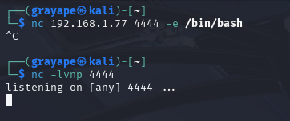

## (PRACTICAL) Basic monitoring
- iftop 

  

- nethog

  

- iptraf-ng

  

---

## (PRACTICAL) Network and connectivity analysis

### ping
Ping is used to test connectivity to another host on a network. It sends ICMP Echo Request messages and reports whether the host responds, along with the round-trip time. It helps detect basic network reachability issues.

### traceroute
Traceroute shows the path that packets take to reach a destination. It lists each router (hop) along the path and measures latency to each one. It is useful for diagnosing where delays or drops occur in the route.

### ip
The `ip` command is used to manage network interfaces, addresses, routing tables, and ARP entries. It replaces older tools like `ifconfig`, `route`, and `arp`, providing more functionality and flexibility.

### netcat
Netcat is a flexible tool used for network diagnostics and debugging. It can open TCP or UDP connections, listen on ports, transfer files, and test services. It is also used for banner grabbing and setting up reverse shells in security contexts.

---

## Network monitoring

Network monitoring involves observing network activity to detect performance issues, downtime, unauthorized access, or security incidents. Tools and logs play a critical role in maintaining operational integrity.

### Tools to monitor the network
Common tools include:
- **iftop**: Real-time bandwidth monitoring by host.
- **nethogs**: Per-process bandwidth usage.
- **iptraf-ng**: Traffic monitoring and statistics.
- **Wireshark**: Deep packet inspection.
- **tcpdump**: Command-line packet capture.
- **Nagios/Zabbix**: Monitoring servers and network devices for availability and performance.

### Log files
Logs provide historical records of events that occur within a system or network. They are critical for troubleshooting, auditing, and forensic investigations.

Key network-related logs:
- **Firewall logs**: Blocked/allowed traffic.
- **DHCP logs**: IP lease history.
- **DNS logs**: Query/resolution attempts.
- **Router/Switch logs**: Port activity, uptime, errors.
- **Authentication logs**: Login attempts, SSH access.

Log analysis can reveal:
- Intrusion attempts
- Misconfigurations
- Performance bottlenecks
- System failures

### Port scanners

#### nmap
Nmap is a powerful network scanner used to discover hosts, open ports, and services running on a network. It is widely used in security auditing and penetration testing for network reconnaissance and vulnerability detection.

### Interface monitoring/packet flow monitoring

#### tcpdump
Tcpdump is a command-line packet analyzer that captures network traffic in real time. It allows users to filter, inspect, and save packets for further analysis. It's lightweight and widely used for diagnostics, scripting, and remote network troubleshooting.

#### wireshark
Wireshark is a graphical network protocol analyzer used to capture and interactively examine packets. It supports deep inspection of hundreds of protocols and is ideal for debugging, protocol development, and learning how networks operate.

## Configuration management

Configuration management is the process of systematically handling changes to maintain the integrity and performance of IT systems and networks. It ensures that hardware, software, firmware, and documentation are consistent and traceable.

Key tools:
- **Ansible**: Agentless configuration automation tool using YAML playbooks.
- **Puppet**: Declarative configuration management for infrastructure as code.
- **Chef**: Uses Ruby for defining infrastructure policies.
- **SaltStack**: Scalable configuration management and remote execution.

Benefits:
- Reduced configuration errors
- Faster deployments
- Easier rollback and version control
- Improved compliance

---

## Documentation

Network documentation refers to detailed records of the architecture, configuration, and policies governing a network. It's essential for troubleshooting, audits, onboarding, and maintaining consistency.

Types of documentation:
- **Network topology diagrams**: Visual representation of physical/logical layout.
- **IP address allocation**: Subnets, reservations, DHCP scopes.
- **Device inventory**: Switches, routers, firewalls, and their configurations.
- **Change logs**: History of updates and modifications.
- **Access control**: Who has access to what and why.

Well-maintained documentation saves time and reduces risk during outages or staff transitions.

---

## Backups

Backups are copies of data or configurations stored separately to restore systems in case of failure, corruption, or disaster.

Backup types:
- **Full**: Complete copy of all selected data.
- **Incremental**: Only data changed since the last backup.
- **Differential**: Data changed since the last full backup.

What to back up:
- Router and switch configs
- Server data and databases
- Virtual machines
- Firewall rules and ACLs

Storage options:
- On-site (external drives, NAS)
- Off-site (remote data center)
- Cloud-based (AWS S3, Google Cloud Storage)

Regular testing of backups is critical for disaster recovery readiness.

## Basic Forensic Concepts and SIEM

- **Chain of custody**: Document all evidence handling
- **Disk imaging**: Bit-for-bit copy of storage for investigation
- **Volatile vs non-volatile data**: RAM vs storage
- **Hashing evidence**: Verifies integrity (SHA-256)
- **Timeline analysis**: Order of attack events
- **Live forensics**: Performed while system is running
- **Anti-forensics**: Tools/methods to hide traces or mislead investigators

### Disaster Recovery Plan
A documented and structured approach that describes how an organization can quickly resume work after an unplanned incident. It focuses on restoring IT systems, applications, and data to ensure minimal downtime. It includes backup solutions, disaster recovery sites, regular testing, and emergency roles and responsibilities.

### Business Continuity Plan
A proactive plan to ensure that critical business operations can continue during and after a disaster. It includes risk assessments, continuity strategies, personnel roles, alternate communication methods, and physical/IT infrastructure requirements.

### Single Point of Failure (SPOF)
A component in a system that, if it fails, will stop the entire system from working. Examples include a single server in a critical workflow or one network switch connecting all departments. Eliminated through redundancy, clustering, and high availability designs.

### Uninterruptable Power Supply (UPS)
A device that provides emergency power when the main power source fails. It protects hardware like servers and networking equipment from sudden power loss, allowing systems to safely shut down or switch to generators.

### First Responders
Individuals trained to react immediately to IT incidents such as cyberattacks or physical security breaches. They perform tasks such as evidence preservation, initiating containment procedures, and notifying relevant authorities or response teams.

### Data Breach
An incident where sensitive, protected, or confidential data is accessed, disclosed, or stolen by unauthorized individuals. Can occur due to poor security configurations, insider threats, or external attackers.

---