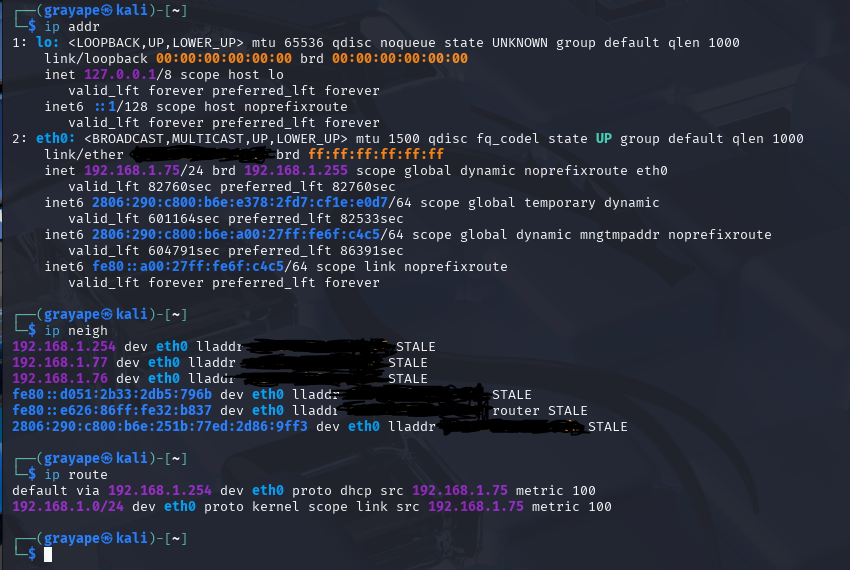
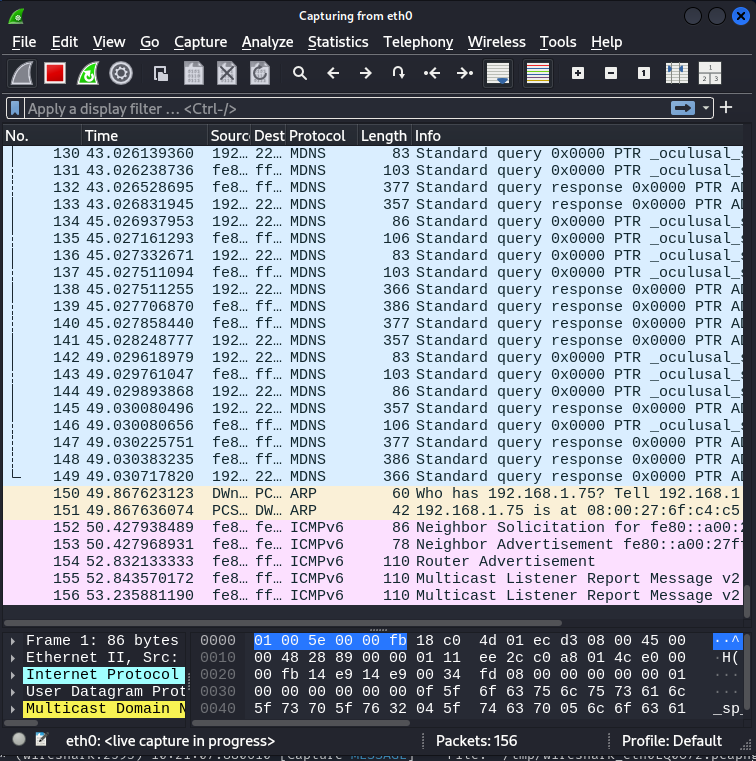

---

title: "1.5_network_operations.net"
date: 2025-06-21T09:22:20-07:00
draft: false
toc: false
images:
tags:
  - Computer Networks
---

*Instrumentation, automation, and disciplined response keep every packet moving and every incident short-lived.*

---
# 1  Monitoring & Visibility

## 1.1  Lightweight Real‑Time Monitors

* **iftop**  — Interface‑level bandwidth by host pair in near real time.
* **nethogs**  — Per‑process network usage; great on jump‑boxes.
* **iptraf‑ng**  — L7‑agnostic traffic stats, TCP flag counters, VLAN tags.

> **Field trick:** Pipe `iftop -n -F 0.0.0.0/0` through `tee` to log peak flows during an incident.

## 1.2  Connectivity & Path Analysis

| Tool            | Image                         | Core Use                         | Hidden Super‑Power                                           |
| --------------- | ----------------------------- | -------------------------------- | ------------------------------------------------------------ |
| **ping**        |              | Reachability & RTT               | `-A` adaptive mode plots jitter like a poor‑man’s smokeping. |
| **traceroute**  |  | Hop‑by‑hop path, per‑hop latency | UDP vs. ICMP vs. TCP mode exposes asymmetric routing.        |
| **ip**          |                  | Interfaces, routes, ARP          | `ip monitor` streams route/addr changes for drift detection. |
| **netcat (nc)** |          | TCP/UDP swiss‑army knife         | `-u -l -p 53` spins a quick DNS sink‑hole.                   |

## 1.3  Enterprise‑Scale Monitoring  Enterprise‑Scale Monitoring

### 1.3.1  Tool Arsenal

* **Nagios / Zabbix** — Polling & trap‑based availability; SLA dashboards.
* **nmap**  — Discovery and compliance (`--script vuln`).
* **tcpdump**  — CLI packet capture; use with `‑G` & `‑W` for ring buffers.
* **Wireshark**  — Deep decode; Follow‑Stream reassembles C2 channels.

### 1.3.2  Log Sources & Enrichment

Firewall • DHCP • DNS • Router/Switch • Authentication • EDR
*Correlate to expose lateral movement, misconfiguration, bottlenecks, hardware failures.*

---

# 2  Configuration Management

Agentless & agent‑based frameworks ensure deterministic, version‑controlled infrastructure:

| Framework     | Ideal Targets                 | Notable Module                                         |
| ------------- | ----------------------------- | ------------------------------------------------------ |
| **Ansible**   | Network OS, Linux, cloud APIs | `ansible‑netcommon` for multi‑vendor CLI.              |
| **Puppet**    | Large OS fleet                | `puppetlabs‑firewall` enforces iptables across estate. |
| **Chef**      | App‑centric deployments       | `chef‑audit` inspects CIS controls.                    |
| **SaltStack** | Event‑driven infra            | Reactor auto‑rolls back drift in seconds.              |

**Benefits:** Fewer human errors • Accelerated rollout • Git‑backed change control • Compliance evidence.

---

# 3  Network Documentation

Accurate, living docs cut MTTR and onboarding time:

* **Topology diagrams** — Draw\.io, NetBox diagrams; include VRF & security zones.
* **IP allocations** — IPAM with DHCP reservations & prefix delegation.
* **Device inventory** — Serial, EOS, OS, warranty, PoE budget.
* **Change logs** — RFC‑style requests → approvals → implementation notes.
* **Access‑control matrices** — Map users ↔ devices ↔ privilege for quick audits.

---

# 4  Backup & Resilience

## 4.1  Backup Fundamentals

| Method           | Pro                             | Con                                |
| ---------------- | ------------------------------- | ---------------------------------- |
| **Full**         | Simplest restore; one file set. | Long backup window, storage heavy. |
| **Incremental**  | Minimal nightly impact.         | Multi‑set restore chain.           |
| **Differential** | Faster restore than incr.       | Larger daily delta.                |

**Scope:** Router/Switch configs • Server OS & DB dumps • VM snapshots • Firewall rules/ACLs.
**Storage tiers:** On‑site NAS → Off‑site vault → Cloud immutable bucket (WORM).
*Test restores quarterly; automate via HashiCorp Vault or Veeam SureBackup.*

## 4.2  Disaster & Continuity Planning

* **DRP** — RTO/RPO targets, cold vs hot sites, tabletop exercises.
* **BCP** — Process‑centric; includes alt‑suppliers, telework, manual overrides.
* **SPOF elimination** — Dual supervisors, MC‑LAG, redundant ISP paths.
* **UPS/Generator orchestration** — SNMP traps trigger VM shutdown if runtime < 5 min.
* **First Responders** — Triage, evidence preservation, legal notifications.
* **Data‑Breach Response** — Contain, notify per GDPR/CCPA, post‑mortem & harden.

---

# 5  Forensics & SIEM

## 5.1  Evidence Lifecycle

1. **Chain of custody** — Document hashes, handlers, timestamps.
2. **Disk imaging** — Bit‑level via `dc3dd`, retain write‑block.
3. **Volatile data** — RAM capture (`avml`, LiME), active TCP tables, `pslist`.
4. **Hashing** — SHA‑256/512 pre‑ & post‑image.
5. **Timeline analysis** — `log2timeline`, SuperTimeline.
6. **Live forensics** — `gcore`, `lsof -i`, Yara scans.
7. **Anti‑forensics tactics** (attacker view) — timestomp, log shredding, packet padding.

## 5.2  Network Forensics & Advanced SIEM

| Component                                           | Purpose                                         | Field Notes                                               |                                                       |
| --------------------------------------------------- | ----------------------------------------------- | --------------------------------------------------------- | ----------------------------------------------------- |
| **PCAP Extraction** (tcpdump, dumpcap)              | Capture raw traffic rings.                      | Use `‑C 100 ‑G 900` for 100 MB/15 min rotation.           |                                                       |
| **Filtering/Indexing** (Zeek)                       | Parses flow + protocol metadata.                | `zeek-cut id.orig_h id.resp_p` to triage IOC hits.        |                                                       |
| **Suricata/Eve JSON**                               | IDS + metadata stream for SIEM.                 | Enable `stats.log` for packet loss auditing.              |                                                       |
| **Wireshark Display Filters**                       | Ad‑hoc decode & reassembly.                     | `tcp.stream eq 7 && http.request` isolates phishing post. |                                                       |
| **NetFlow/IPFIX**                                   | High‑level flow records (nfdump, FlowExporter). | Detect beaconing via low‑byte, high‑freq flows.           |                                                       |
| **SIEM Correlation** (Splunk, ELK/Elastic, Graylog) | Multi‑source alerting & hunt dashboards.        | Chain \`index=netflow                                     | transaction src,dst maxspan=30s\` to catch port‑hops. |

**Attacker optic:** Hide C2 by domain‑fronting (HTTPS 443) & timing jitter; Blue team counters with JA3 hash matching & beacon score heatmaps.

---

# 6  Pivoting & Tunneling

Lateral movement and covert channel essentials for both Red & Blue teams.

| Technique                  | Command Snippet                                          | Detection Hint                                                           |
| -------------------------- | -------------------------------------------------------- | ------------------------------------------------------------------------ |
| **SSH Local Port‑Forward** | `ssh -L 13389:10.0.0.5:3389 user@gw`                     | Outbound 22 bursts to jump‑box; monitor unusual dest ports on localhost. |
| **SSH Remote Forward**     | `ssh -R 0.0.0.0:8888:127.0.0.1:80 user@gw`               | New listener on gateway; watch `ss -lntp`.                               |
| **Dynamic (SOCKS) Proxy**  | `ssh -D 9050 user@gw` + `proxychains`                    | look for local 1080/9050 sockets.                                        |
| **socat** multiproto Relay | `socat TCP4-LISTEN:9999,fork TCP4:10.0.0.9:445`          | Parent PID not root; kernel audit for unusual binds.                     |
| **chisel** reverse tunnel  | `chisel server -p 8000` / `chisel client gw:8000 R:1080` | Binary in tmp; high entropy traffic.                                     |
| **VPN Split‑Tunnels**      | Include‑only corp prefixes; rest via ISP.                | SIEM cross‑check route table vs login vlan.                              |
| **C2 Traffic Re‑flux**     | DNS‑over‑HTTPS, cloud drive APIs.                        | Detect via JA3 fingerprints & size‑time patterns.                        |

> **Blue tip:** Alert when workstations open listeners >1024 or when SSH starts with unusual flags.
